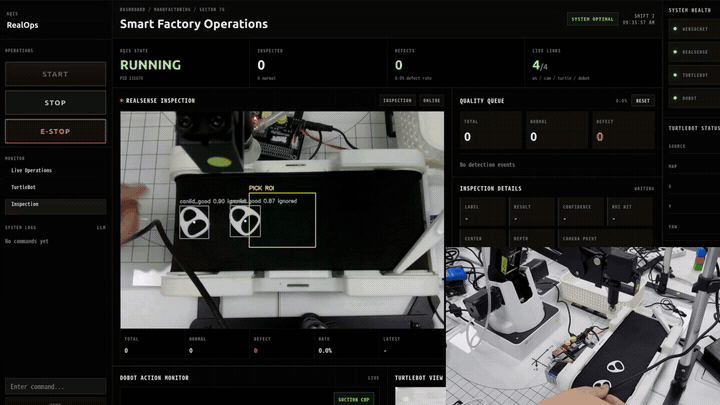
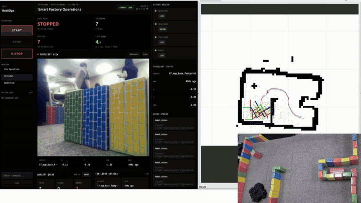
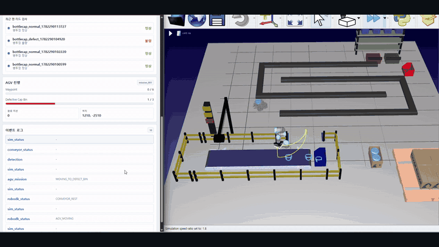
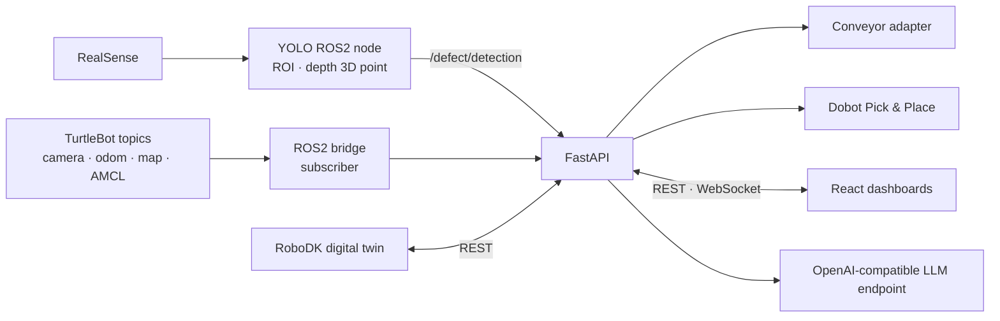

# AQIS for SmartFactory

> **AI Quality Inspection System** — a smart-factory project combining real-device quality inspection, robotic sorting, live operations, and a digital-twin transport scenario.

<p align="center">
  
</p>

<p align="center">
  <a href="#key-features">Features</a> ·
  <a href="#architecture">Architecture</a> ·
  <a href="#team-and-contributions">Team</a> ·
  <a href="#quick-setup">Setup</a> ·
  <a href="./README.md">한국어</a>
</p>

| Item | Details |
|---|---|
| Team | SSAFY 15th, Gwangju Class 4, Team 3 · 2 members |
| Timeline | 4-week development in June 2026 · initial planning in May 2026 |
| Hardware | Intel RealSense, Dobot Magician, TurtleBot3 Waffle, conveyor |
| Core stack | ROS2 Humble, YOLOv5, FastAPI, WebSocket, React, Three.js, RoboDK |

## Problem and Approach

A smart-factory inspection line must connect cameras, conveyors, robot arms, and an operations dashboard. AQIS integrates the real-device inspection and sorting flow below. TurtleBot transport is scoped separately as a RoboDK scenario plus SLAM and state-monitoring demonstrations.

```text
Can lid → RealSense + YOLO inspection → defect event → stop conveyor
→ Dobot suction pick-and-place → resume process → update React dashboard
```

The team used one FastAPI backend and event model with separate mock, simulation, and real routes and adapters. This allowed the RoboDK digital twin and dashboards to be developed before all hardware was available, then extended to real devices.

## Key Features

### RealSense and YOLO inspection

- Detects normal and abnormal can-lid candidates with a custom YOLOv5 model
- Applies a central ROI and confidence threshold
- Uses aligned depth frames to estimate the median depth and camera-space 3D point
- Publishes `/detection_image` and `/defect/detection` ROS2 topics

### Defect-triggered pick-and-place integration

- Stops the conveyor when a defect event arrives
- Converts the latest camera point into a dynamic Dobot pick pose
- Implements and demonstrates suction pick-and-place followed by process resume
- Supports real and mock execution modes for integration testing

### Real-time operations dashboard

- FastAPI integrates REST, WebSocket, the ROS2 bridge, and device processes
- Displays inspection counts, live feeds, maps, TurtleBot pose, and Dobot TCP/joint state
- Provides Start, Stop, E-Stop, and event logs
- Renders the Dobot state in 3D with Three.js

### RoboDK digital twin

- Models the inspection, sorting, and transport workflow with a UR5, vacuum gripper, conveyor, TurtleBot, and factory assets
- Shares the backend and event model used by the real-hardware path
- Includes a simulation dashboard built before the real operations UI

### LLM text commands

- Classifies start, stop, and status-query intents through an OpenAI-compatible API
- Falls back to keyword rules when the LLM endpoint is unavailable
- Routes emergency-stop phrases directly without waiting for the LLM

## Demo

### 1. Real inspection and Dobot sorting

<p align="center">
  
</p>

RealSense depth data and YOLO determine lid defects, then the conveyor and Dobot sort each product according to the result.

### 2. TurtleBot SLAM and live operations

<p align="center">
  
</p>

The dashboard brings the camera feed, SLAM map, robot pose, and event stream together for real-time navigation monitoring.

### 3. RoboDK digital twin

<p align="center">
  
</p>

The digital twin reuses the real system's backend and event model to verify inspection, sorting, and transport scenarios in RoboDK.

The three original recordings remain in the team's private Drive. Lightweight GIFs expose only the key sequences so public visitors can review the system without Drive access.

## Architecture



| Layer | Components | Responsibility |
|---|---|---|
| Device / ROS2 | RealSense, YOLO node, Dobot, TurtleBot3, conveyor | Inspection, robot state, process control |
| Integration | FastAPI, ROS2 bridge, WebSocket, process control | Device events and web commands |
| Application | RealOps Dashboard, Simulation Dashboard, LLM proxy | Monitoring, control, and simulation |

See the [real-hardware startup guide](./docs/real-hardware-startup.md) for the process-by-process launch order. The ROS2 bridge currently subscribes to robot state; automatic TurtleBot Nav2 goal publishing remains future work.

## Implemented and Verification Scope

Implemented:

- RealSense + YOLO + depth inspection pipeline
- Defect detection → conveyor stop → Dobot pick-and-place → process resume
- FastAPI + WebSocket real-time state delivery
- RealOps and Simulation dashboards
- RoboDK digital twin and real-device integration structure
- TurtleBot camera, odometry, map, AMCL monitoring, and SLAM demonstration

Still requires quantitative verification:

- Final can-lid model performance on an independent test set
- Long-run false-positive/false-negative rates and cycle time
- Repeated Dobot pick-and-place success rate
- Automatic TurtleBot dispatch and Nav2 mission flow
- Persistent inspection analytics and production-grade exception handling

Target values in early planning documents are not presented as achieved results. This README and the real-hardware guide are the current implementation references.

## Team and Contributions

| Member | Role | Main contributions |
|---|---|---|
| [Se Min Kong](https://github.com/SeMinKong) | Team lead · Full-stack / Robot Integration | RealOps Dashboard, FastAPI, REST/WebSocket, ROS2 bridge, conveyor and Dobot integration, LLM endpoint integration |
| [Eunbin Hyun](https://github.com/eunbin-hyun) | Simulation / AI / 3D | Simulation Dashboard, RoboDK digital twin, robot workflow scripts, Onshape design, Roboflow data, YOLO training¹ |

See [team contributions and timeline](./docs/07-roles-and-schedule.md).

¹ The Onshape, Roboflow, and YOLO-training attribution follows the final presentation. Commit authorship for externally produced training assets is not treated as the sole ownership record.

## Repository Layout

```text
AQIS-for-SmartFactory/
  aqis_ws/src/integrate_prac/  # RealSense YOLO, ROI, depth, detection ROS2 node
  AQIS-real/                   # Real UI, conveyor server, Dobot scripts
  AQIS-sim/                    # RoboDK digital twin and simulation UI
  server/                      # FastAPI, ROS2 bridge, WebSocket, LLM proxy
  maps/                        # Nav2/SLAM maps
  config/nav2/                 # Nav2/AMCL parameters
  docs/                        # Current operations docs and early planning material
  ros2.repos                   # External ROS source dependencies
```

## Quick Setup

Target environment: Ubuntu 22.04 + ROS2 Humble.

```bash
git clone https://github.com/SSAFY-15th-HK/AQIS-for-SmartFactory.git
cd AQIS-for-SmartFactory
export AQIS_ROOT="$(pwd)"
./scripts/setup_dev.sh
```

For each new shell:

```bash
source /opt/ros/humble/setup.bash
source "$AQIS_ROOT/aqis_ws/install/setup.bash"
export ROS_DOMAIN_ID=33
export AQIS_YOLOV5_REPO=~/yolov5
```

Create the backend env file:

```bash
cd "$AQIS_ROOT/server"
cp .env.example .env
```

Set hardware IPs, the LLM endpoint/token, and Dobot calibration values in `server/.env`. Never commit that file or its secrets.

## External ROS Packages

Third-party build outputs are not tracked. Their source repositories are declared in `ros2.repos`.

| Purpose | Repository | Recommended path |
|---|---|---|
| Dobot Magician | `https://github.com/jkaniuka/magician_ros2.git` | source build |
| RealSense ROS wrapper | `https://github.com/realsenseai/realsense-ros.git` | apt or source build |
| TurtleBot3 | `https://github.com/ROBOTIS-GIT/turtlebot3.git` | official workspace or source build |

```bash
mkdir -p ~/aqis_external_ws/src
cd ~/aqis_external_ws
vcs import src < "$AQIS_ROOT/ros2.repos"
rosdep install --from-paths src --ignore-src -r -y
colcon build --symlink-install
source ~/aqis_external_ws/install/setup.bash
```

## Real Hardware Startup

Use [docs/real-hardware-startup.md](./docs/real-hardware-startup.md) as the source of truth.

1. TurtleBot3 bringup
2. Nav2 or SLAM
3. Dobot bringup
4. RealSense YOLO
5. Conveyor HTTP server
6. FastAPI server
7. React RealOps Dashboard

<details>
<summary>Core commands</summary>

RealSense YOLO:

```bash
ros2 launch integrate_prac realsense_yolo.launch.py \
  confidence:=0.7 \
  roi_width:=220 \
  roi_height:=180
```

FastAPI:

```bash
cd "$AQIS_ROOT/server"
source /opt/ros/humble/setup.bash
source ../aqis_ws/install/setup.bash
.venv-ros/bin/uvicorn app.main:app --host 0.0.0.0 --port 8000
```

RealOps Dashboard:

```bash
cd "$AQIS_ROOT/AQIS-real/web"
npm run dev -- --host 0.0.0.0 --port 5173
```

</details>

## Important ROS2 Topics

| Topic | Purpose |
|---|---|
| `/detection_image` | YOLO-annotated ROS2 `sensor_msgs/Image`; `web_video_server` exposes it as MJPEG |
| `/defect/detection` | Detection result JSON consumed by FastAPI |
| `/dobot_joint_states` | Dobot joint state |
| `/dobot_pose_raw` | Dobot raw TCP pose |
| `/odom`, `/amcl_pose` | TurtleBot pose |
| `/map` | SLAM/Nav2 map |

## Documentation

- [Documentation index](./docs/README.md)
- [Real-hardware startup guide](./docs/real-hardware-startup.md)
- [Real workspace](./AQIS-real/README.md)
- [RoboDK simulation](./AQIS-sim/README.md)

## License

No open-source license has been selected. Reuse or redistribution rights are therefore not granted unless explicitly stated.
