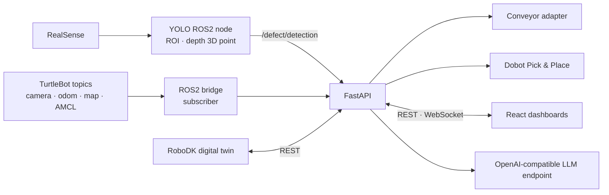

# AQIS for SmartFactory

> **AI Quality Inspection System** — 실제 장비의 품질 검사·로봇 분류·실시간 관제와 디지털 트윈 운반 시나리오를 구현한 스마트팩토리 프로젝트

<p align="center">
  
</p>

<p align="center">
  <a href="#핵심-기능">핵심 기능</a> ·
  <a href="#시스템-아키텍처">아키텍처</a> ·
  <a href="#팀과-기여">팀</a> ·
  <a href="#빠른-설치">실행 방법</a> ·
  <a href="./README.en.md">English</a>
</p>

| 구분 | 내용 |
|---|---|
| 팀 | SSAFY 15기 광주 4반 3조 · 2명 |
| 기간 | 2026.06 · 4주 · 초기 기획 2026.05 |
| 실제 장비 | Intel RealSense, Dobot Magician, TurtleBot3 Waffle, 컨베이어 |
| 핵심 기술 | ROS2 Humble, YOLOv5, FastAPI, WebSocket, React, Three.js, RoboDK |

## 문제와 해결

스마트팩토리의 품질 검사는 카메라, 컨베이어, 로봇팔과 관제 화면이 서로 연결되어야 합니다. AQIS는 실제 장비에서 아래 검사·분류 흐름을 통합했고, TurtleBot 운반 시나리오는 RoboDK 디지털 트윈과 SLAM·상태 모니터링으로 검증 범위를 나눴습니다.

```text
캔 뚜껑 투입 → RealSense + YOLO 검사 → 불량 이벤트 → 컨베이어 정지
→ Dobot 흡착 Pick & Place → 공정 재개 → React 대시보드 실시간 반영
```

하드웨어 준비가 늦어져도 개발을 이어갈 수 있도록 하나의 FastAPI 백엔드와 이벤트 모델 위에 mock·simulation·real 경로와 adapter를 분리했습니다. RoboDK 디지털 트윈과 웹 대시보드를 먼저 개발한 뒤 실제 장비 경로로 확장했습니다.

## 핵심 기능

### 1. RealSense 기반 YOLO 품질 검사

- 커스텀 YOLOv5 모델로 캔 뚜껑의 정상·불량 후보 검출
- 중앙 ROI 필터와 confidence threshold 적용
- 정렬된 depth 영상의 중앙값으로 카메라 기준 3D 좌표 계산
- `/detection_image`, `/defect/detection` ROS2 토픽 발행

### 2. 불량 검출 기반 Pick & Place 연동

- 불량 이벤트 수신 시 컨베이어 즉시 정지
- 최신 detection 좌표를 Dobot 좌표로 변환해 동적 pick pose 생성
- 진공 흡착 Pick & Place와 공정 재개 흐름 구현·시연
- 실제 장비와 mock 실행 모드를 분리해 연동 테스트 가능

### 3. 실시간 통합 관제

- FastAPI가 REST API, WebSocket, ROS2 bridge와 장비 프로세스를 통합
- 검사 수, 불량 수, 카메라 영상, 맵, TurtleBot 위치, Dobot TCP·joint 상태 표시
- Start, Stop, E-Stop 및 이벤트 로그 제공
- Three.js 기반 Dobot 3D 상태 모니터링

### 4. RoboDK 디지털 트윈

- UR5, 진공 그리퍼, 컨베이어, TurtleBot과 공장 자산으로 공정 구성
- 실제 장비와 백엔드·이벤트 모델을 공유하며 검사→분류→운반 시나리오 검증
- Simulation Dashboard를 실제 장비 UI보다 먼저 개발하는 mock-first 전략 적용

### 5. LLM 텍스트 명령

- OpenAI 호환 API를 이용해 시작·정지·상태 조회 의도 분류
- LLM 장애 시 키워드 기반 fallback
- 긴급 정지 표현은 LLM을 우회해 직접 E-Stop 처리

## 데모

### 1. 실제 품질 검사 · Dobot 분류

<p align="center">
  
</p>

RealSense 깊이 카메라와 YOLO가 캔 뚜껑의 불량을 판정하고, 컨베이어와 Dobot이 결과에 따라 제품을 분류합니다.

### 2. TurtleBot SLAM · 실시간 관제

<p align="center">
  
</p>

카메라 영상, SLAM 지도, 로봇 위치와 이벤트 스트림을 한 화면에서 확인하며 SLAM·주행 상태를 관제합니다.

### 3. RoboDK 디지털 트윈

<p align="center">
  
</p>

실제 장비와 동일한 백엔드·이벤트 모델을 사용해 검사, 분류, 운반 시나리오를 RoboDK에서 검증합니다.

Drive의 원본 영상 3개는 팀 내부 자료로 유지하고, 외부 방문자가 바로 확인할 수 있도록 핵심 구간만 경량 GIF로 공개했습니다.

## 시스템 아키텍처



| 계층 | 구성요소 | 역할 |
|---|---|---|
| Device / ROS2 | RealSense, YOLO node, Dobot, TurtleBot3, 컨베이어 | 검사, 로봇 상태, 공정 제어 |
| Integration | FastAPI, ROS2 bridge, WebSocket, process control | 장치 이벤트와 웹 명령 통합 |
| Application | RealOps Dashboard, Simulation Dashboard, LLM proxy | 모니터링, 제어, 시뮬레이션 |

실제 장비의 프로세스별 실행 순서는 [실제 장비 시작 가이드](./docs/real-hardware-startup.md)를 참고하세요. 현재 ROS2 bridge는 TurtleBot과 Dobot 상태를 구독하며, TurtleBot Nav2 goal 자동 발행은 후속 과제입니다.

## 구현 결과와 검증 범위

완료한 범위:

- RealSense + YOLO + depth 기반 검사 파이프라인
- 불량 검출 → 컨베이어 정지 → Dobot Pick & Place → 재개 흐름
- FastAPI + WebSocket 기반 실시간 상태 전달
- RealOps / Simulation 웹 대시보드
- RoboDK 디지털 트윈과 실제 장비 연동 구조
- TurtleBot 카메라·odom·map·AMCL 상태 모니터링 및 SLAM 시연

아직 정량 검증이 필요한 범위:

- 최종 캔 뚜껑 모델의 독립 테스트셋 성능
- 장시간 공정의 오탐·미탐률과 전체 cycle time
- Dobot Pick & Place 반복 성공률
- TurtleBot 자동 출동 및 Nav2 임무 흐름
- 검사 결과 DB 저장·분석과 산업 수준의 예외·안전 처리

초기 기획 문서의 목표 수치는 최종 성과로 사용하지 않습니다. 현재 README와 실제 장비 가이드를 구현 상태의 기준으로 삼습니다.

## 팀과 기여

| 구성원 | 역할 | 주요 기여 |
|---|---|---|
| [공세민](https://github.com/SeMinKong) | 팀장 · Full-stack / Robot Integration | RealOps Dashboard, FastAPI, REST·WebSocket, ROS2 bridge, 컨베이어·Dobot 연동, LLM 서버 연동 |
| [현은빈](https://github.com/eunbin-hyun) | Simulation / AI / 3D | Simulation Dashboard, RoboDK 디지털 트윈, 로봇 공정 스크립트, Onshape 설계, Roboflow 데이터, YOLO 학습¹ |

역할과 실제 구현 범위는 [팀 구성 및 일정](./docs/07-roles-and-schedule.md)에 정리했습니다.

¹ Onshape·Roboflow·YOLO 학습 역할은 최종 발표자료 기준입니다. 외부 학습 산출물의 Git 커밋 계정과 실제 담당자를 동일하게 보지 않았습니다.

## 저장소 구조

```text
AQIS-for-SmartFactory/
  aqis_ws/src/integrate_prac/  # RealSense YOLO, ROI, depth, detection ROS2 node
  AQIS-real/                   # 실제 장비 UI, 컨베이어 서버, Dobot 스크립트
  AQIS-sim/                    # RoboDK 디지털 트윈과 시뮬레이션 UI
  server/                      # FastAPI, ROS2 bridge, WebSocket, LLM proxy
  maps/                        # Nav2/SLAM 지도
  config/nav2/                 # Nav2/AMCL 파라미터
  docs/                        # 현재 운영 문서와 초기 기획 자료
  ros2.repos                   # 외부 ROS 소스 의존성 목록
```

## 빠른 설치

기준 환경은 Ubuntu 22.04 + ROS2 Humble입니다.

```bash
git clone https://github.com/SSAFY-15th-HK/AQIS-for-SmartFactory.git
cd AQIS-for-SmartFactory
export AQIS_ROOT="$(pwd)"
./scripts/setup_dev.sh
```

새 터미널마다:

```bash
source /opt/ros/humble/setup.bash
source "$AQIS_ROOT/aqis_ws/install/setup.bash"
export ROS_DOMAIN_ID=33
export AQIS_YOLOV5_REPO=~/yolov5
```

서버 환경 파일:

```bash
cd "$AQIS_ROOT/server"
cp .env.example .env
```

실제 장비 IP, LLM URL/token, Dobot 보정값은 `server/.env`에서 환경에 맞게 수정합니다. `.env`와 비밀값은 Git에 커밋하지 않습니다.

## 외부 ROS 패키지

외부 ROS 패키지의 빌드 결과는 저장소에 포함하지 않고 `ros2.repos`와 문서로 재현합니다.

| 용도 | 저장소 | 권장 방식 |
|---|---|---|
| Dobot Magician | `https://github.com/jkaniuka/magician_ros2.git` | source build |
| RealSense ROS wrapper | `https://github.com/realsenseai/realsense-ros.git` | apt 또는 source build |
| TurtleBot3 | `https://github.com/ROBOTIS-GIT/turtlebot3.git` | 공식 workspace 또는 source build |

```bash
mkdir -p ~/aqis_external_ws/src
cd ~/aqis_external_ws
vcs import src < "$AQIS_ROOT/ros2.repos"
rosdep install --from-paths src --ignore-src -r -y
colcon build --symlink-install
source ~/aqis_external_ws/install/setup.bash
```

## 실제 장비 실행

[실제 장비 시작 가이드](./docs/real-hardware-startup.md)를 기준으로 실행합니다.

1. TurtleBot3 bringup
2. Nav2 또는 SLAM
3. Dobot bringup
4. RealSense YOLO
5. 컨베이어 HTTP 서버
6. FastAPI 서버
7. React RealOps Dashboard

<details>
<summary>핵심 실행 명령 보기</summary>

RealSense YOLO:

```bash
ros2 launch integrate_prac realsense_yolo.launch.py \
  confidence:=0.7 \
  roi_width:=220 \
  roi_height:=180
```

FastAPI:

```bash
cd "$AQIS_ROOT/server"
source /opt/ros/humble/setup.bash
source ../aqis_ws/install/setup.bash
.venv-ros/bin/uvicorn app.main:app --host 0.0.0.0 --port 8000
```

RealOps Dashboard:

```bash
cd "$AQIS_ROOT/AQIS-real/web"
npm run dev -- --host 0.0.0.0 --port 5173
```

</details>

## 주요 ROS2 토픽

| 토픽 | 용도 |
|---|---|
| `/detection_image` | YOLO annotation이 포함된 ROS2 `sensor_msgs/Image`; `web_video_server`가 MJPEG로 제공 |
| `/defect/detection` | FastAPI가 수신하는 검사 결과 JSON |
| `/dobot_joint_states` | Dobot 관절 상태 |
| `/dobot_pose_raw` | Dobot raw TCP pose |
| `/odom`, `/amcl_pose` | TurtleBot 위치 |
| `/map` | SLAM/Nav2 지도 |

## 문서

- [문서 인덱스](./docs/README.md)
- [실제 장비 시작 가이드](./docs/real-hardware-startup.md)
- [실제 장비 workspace](./AQIS-real/README.md)
- [RoboDK 시뮬레이션](./AQIS-sim/README.md)

## License

이 저장소에는 아직 별도 오픈소스 라이선스가 지정되지 않았습니다. 따라서 명시적인 허가 없이 코드의 재사용·재배포 권한이 부여되지 않습니다.
